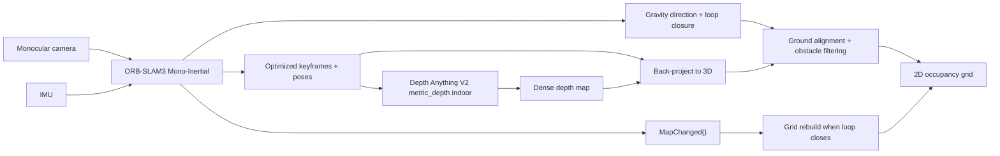

# 单目 + IMU 小车 2D 建图方案设计与实施文档

## 1. 文档目的

本文档给出一套面向家庭室内小车的完整方案，目标是在仅使用单目相机和 IMU 的前提下，基于小车运动构建可用的 2D 地图，并在条件允许时引入 `Depth Anything V2 metric_depth` 对关键帧进行稠密化，提升障碍物投影和 2D 栅格地图质量。

文档覆盖以下内容：

- 原理自洽的系统解释
- 分阶段计划
- 具体实施步骤
- 验证、排障、定位问题的方法
- 与当前仓库的代码挂点对应关系

本文档的核心原则是：

1. 先证明定位链路稳定，再增加深度网络
2. 先做离线、可重放、可复现，再做在线实时
3. 先做可解释的中间产物，再做最终地图
4. 让系统的尺度基准以视觉惯性 SLAM 为主，深度网络负责补稠密结构，不负责决定系统主尺度

## 2. 目标与边界

### 2.1 目标

系统最终输出一张家庭室内可用的 2D 占据栅格地图，能够表示：

- 墙体的大致轮廓
- 大件家具和障碍物的大致位置
- 小车走过区域的自由空间与未知区域

同时系统需要满足：

- 可以离线重放录包，复现实验结果
- 可以逐阶段验证，不把多个新变量同时引入
- 出现问题时可以定位到具体子模块，而不是只能看到最终地图“看起来不对”

### 2.2 非目标

本文档不把以下内容作为第一阶段目标：

- 激光雷达级别的高精度测距
- 稠密 3D 重建
- 动态障碍物长期建模
- 多层楼、多高度复杂结构建图
- 大范围长期鲁棒导航系统

## 3. 当前仓库中的可复用挂点

本仓库已经具备这条方案所需的几个关键基础点：

1. `System::TrackMonocular(...)` 已支持可选 IMU 输入，可作为单目惯性主入口  
   见 [include/System.h](/Users/xy/work/ORB_SLAM3/include/System.h:121)

2. 仓库 README 已明确提供 Monocular-Inertial 运行方式  
   见 [README.md](/Users/xy/work/ORB_SLAM3/README.md:257)

3. `Examples/Monocular-Inertial/mono_inertial_euroc.cc` 展示了图像与 IMU 数据打包后送入 `TrackMonocular(...)` 的参考方式  
   见 [Examples/Monocular-Inertial/mono_inertial_euroc.cc](/Users/xy/work/ORB_SLAM3/Examples/Monocular-Inertial/mono_inertial_euroc.cc:119)

4. `LocalMapping::Run()` 是关键帧进入局部建图流程的天然挂点，适合旁路派发关键帧给稠密化线程  
   见 [src/LocalMapping.cc](/Users/xy/work/ORB_SLAM3/src/LocalMapping.cc:64)

5. `System::MapChanged()` 可以感知回环或全局优化导致的大地图变化，适合作为 2D 地图重建触发器  
   见 [src/System.cc](/Users/xy/work/ORB_SLAM3/src/System.cc:511)

6. `System::GetTrackedMapPoints()` 与 `System::GetTrackedKeyPointsUn()` 已暴露当前跟踪帧的稀疏锚点，可用于网络深度与 SLAM 几何之间的尺度对齐  
   见 [src/System.cc](/Users/xy/work/ORB_SLAM3/src/System.cc:1343)

7. 仓库已有一个“单目 + 深度网络 + 稀疏几何做深度缩放 + 点云积分”的原型，可直接吸收其工程经验  
   见 [Examples/Monocular/map_webcam_coreml.cc](/Users/xy/work/ORB_SLAM3/Examples/Monocular/map_webcam_coreml.cc:543)

这意味着我们并不是从零开始设计，而是在已有 `Mono-Inertial` 主链上增加一条“关键帧稠密化与 2D 建图”的旁路能力。

## 4. 系统总览

### 4.1 总体思路

整套系统可以分成四层：

1. 传感器层  
   采集单目图像和 IMU 数据

2. 位姿层  
   使用 ORB-SLAM3 Monocular-Inertial 估计小车轨迹、关键帧、稀疏地图、回环约束

3. 稠密观测层  
   对关键帧运行 `Depth Anything V2 metric_depth`，将关键帧补成稠密深度图，再利用位姿反投影到世界坐标系

4. 2D 地图层  
   从世界坐标下的 3D 点中提取障碍物，投影到地面，并更新 2D occupancy grid

### 4.2 数据流

### 4.3 原理上为什么可行

这套方案可行的原因在于三件事情可以形成闭环：

1. 单目 + IMU 可以恢复小车的运动轨迹和世界参考方向  
   单目提供视觉几何约束，IMU 提供高频旋转与加速度约束。两者联合优化后，可以求解位姿、速度、偏置，并在可观条件满足时确定全局尺度。

2. 关键帧深度图可以把稀疏几何补成稠密观测  
   ORB-SLAM3 的稀疏点足够做定位和回环，但不够直接做稳定的占据栅格。网络深度图虽然不是激光真值，但能提供密集的“哪里可能有物体”的几何先验。

3. IMU 的重力方向让 3D 到 2D 的投影可解释  
   有了稳定的“竖直向上”方向，3D 点就能可靠地按高度切片，并投影到地面，形成 2D 地图。

## 5. 核心原理

## 5.1 视觉惯性 SLAM 的角色

视觉惯性 SLAM 负责回答两个问题：

- 小车现在在什么位置、朝什么方向
- 小车从前一时刻到当前时刻是如何运动的

在 ORB-SLAM3 中，这部分由图像特征跟踪、IMU 预积分、局部 BA、回环检测共同完成。对于本方案，视觉惯性 SLAM 是主骨架，必须先稳定，再谈建图。

### 5.1.1 相机提供什么

相机负责在相邻帧之间建立对应关系，例如：

- 墙角
- 门框边缘
- 桌腿、柜角
- 纹理稳定的地面或物体表面

这些对应关系被用来约束“同一个 3D 点在不同相机位姿下应该投影到哪里”。

### 5.1.2 IMU 提供什么

IMU 提供：

- 陀螺仪角速度，帮助短时间姿态预测
- 加速度计数据，帮助估计加速度、重力方向和尺度

IMU 的价值不只是让系统更稳，还在于给 2D 地图提供“哪个方向是地面法向”的可靠参考。

### 5.1.3 为什么初始化运动激励很重要

视觉惯性系统需要在起步阶段估计：

- 初始姿态
- 初速度
- 重力方向
- IMU 偏置
- 单目尺度

如果小车一直匀速直线运动，这些变量不可观或弱可观，初始化容易失败或尺度不稳。工程上要求起步阶段至少包含：

- 一定角速度变化
- 一定加减速
- 不要只看纯白墙

## 5.2 为什么 `Depth Anything V2 metric_depth` 只跑关键帧

对每一帧都跑深度网络并不划算，原因有三点：

1. 计算量大，容易拖慢实时跟踪
2. 邻近普通帧高度重复，信息增益低
3. 关键帧已经过 SLAM 约束，位姿更稳定，更适合做世界系融合

因此本方案采用：

- 实时主线程只做 ORB-SLAM3 跟踪
- 当新关键帧进入局部建图后，异步送到深度线程
- 深度线程返回关键帧深度图
- 地图线程再把这些深度图转为 3D 观测并融合

## 5.3 尺度来源必须自洽

这是本方案最关键的原理约束。

### 5.3.1 主尺度来源

系统的主尺度应以 `ORB-SLAM3 Mono-Inertial` 为主。原因是：

- VIO 的尺度来自多帧运动和 IMU 约束
- 它决定的是整个轨迹和地图的全局一致性
- 回环和全局优化也会修正这套尺度下的历史位姿

### 5.3.2 深度网络的角色

`Depth Anything V2 metric_depth` 的角色不是决定系统尺度，而是提供每个关键帧内部更密集的几何结构。即使它输出的是“米制深度”，工程上也应把它视为：

- 稠密观测
- 结构先验
- 局部表面估计

而不是全局真值深度。

### 5.3.3 为什么仍然要做深度缩放校正

即便使用 `metric_depth`，网络预测与 VIO 世界尺度之间仍可能存在偏差。真实工程中应该使用稀疏锚点做每关键帧的尺度校正：

对于当前关键帧中可见的稀疏地图点，计算：

- `d_slam_i`：该点在当前相机坐标系下的几何深度
- `d_net_i`：该点像素位置上的网络深度

得到尺度估计：

`s_k = median_i(d_slam_i / d_net_i)`

然后使用：

`D_hat_k = s_k * D_net_k`

作为这张关键帧参与融合的深度图。

本仓库现有 `map_webcam_coreml.cc` 已经体现了这种思路，使用 `GetTrackedMapPoints()`、`GetTrackedKeyPointsUn()` 和 `ComputeDepthScale(...)` 来估计平滑尺度。  
见 [Examples/Monocular/map_webcam_coreml.cc](/Users/xy/work/ORB_SLAM3/Examples/Monocular/map_webcam_coreml.cc:603)

这让整个系统保持自洽：

- 全局尺度听 VIO 的
- 局部稠密结构听深度网络的
- 两者通过锚点比例耦合，而不是互相替代

## 5.4 深度图如何变成世界坐标系 3D 点

给定关键帧像素 `(u, v)`，深度图值 `z = D_hat(u, v)`，相机内参 `fx, fy, cx, cy`，则其在相机坐标系中的 3D 点为：

`x = (u - cx) / fx * z`

`y = (v - cy) / fy * z`

`P_c = [x, y, z, 1]^T`

若当前关键帧的相机到世界位姿为 `T_wc`，则：

`P_w = T_wc * P_c`

这样每个关键帧都能贡献一片局部 3D 点云。

## 5.5 如何从 3D 点得到 2D 地图

2D 地图不是直接从相机图像得到的，而是从世界坐标系下的 3D 点做“地面投影”得到的。

步骤如下：

1. 用 IMU 确定世界坐标中的“竖直向上”
2. 对所有 3D 点按高度分层
3. 去掉地面附近点和天花板附近点
4. 保留障碍物高度范围内的点
5. 把这些点投影到地面平面
6. 更新 2D 栅格地图

高度过滤的典型范围可以先从以下参数开始：

- 地面剔除阈值：`0.03m ~ 0.08m`
- 障碍物保留高度：`0.05m ~ 1.2m`
- 室内最大深度：`4m ~ 6m`

## 5.6 为什么回环后需要“重建地图”而不是只增量更新

ORB-SLAM3 发生回环后，历史关键帧的位姿会被全局优化修正。若 2D 地图只是简单增量累加，回环后容易出现：

- 双墙
- 拖影
- 家具轮廓错位

因此 2D 地图模块应该缓存：

- 关键帧图像或关键帧深度结果
- 每个关键帧的融合参数
- 每个关键帧的最终世界位姿

当 `System::MapChanged()` 报告大地图变化时，应以“关键帧重投影 + 栅格重建”为主，而不是只在旧地图上打补丁。  
见 [src/System.cc](/Users/xy/work/ORB_SLAM3/src/System.cc:511)

## 6. 系统架构建议

## 6.1 线程划分

建议采用四条职责清晰的线程：

1. `SLAM 主线程`  
   输入图像和 IMU，运行 ORB-SLAM3 跟踪、局部建图、回环

2. `关键帧深度线程`  
   接收关键帧图像，运行 `Depth Anything V2 metric_depth indoor`

3. `稠密融合线程`  
   将深度图反投影成 3D 点，并进行体素滤波、高度过滤、局部融合

4. `2D 地图线程`  
   管理 occupancy grid，处理自由空间更新、回环重建、地图导出

这样设计的原因是：

- 跟踪主线程不能被深度推理阻塞
- 地图融合和地图渲染应与位姿估计解耦
- 出现性能瓶颈时，最容易单独压测和定位

## 6.2 模块职责

建议新增或拆分出以下模块：

1. `Recorder / Replayer`
   - 录制图像、IMU、时间戳、配置
   - 支持离线回放

2. `PoseBridge`
   - 从 ORB-SLAM3 提取关键帧位姿、轨迹、MapChanged 事件

3. `DepthRunner`
   - 管理深度网络推理
   - 维护关键帧队列
   - 返回深度图与推理状态

4. `DepthScaleAligner`
   - 使用稀疏地图点对深度图做尺度校正
   - 输出平滑尺度 `s_k`

5. `DenseProjector`
   - 相机坐标反投影
   - 转世界坐标
   - 体素下采样

6. `GroundAligner`
   - 根据重力方向对齐世界系
   - 做地面/障碍物分离

7. `GridMapper`
   - 将障碍物点投影到 2D 栅格
   - 管理 `occupied/free/unknown`
   - 负责重建和导出

8. `DebugExporter`
   - 保存轨迹、关键帧、深度图、局部点云、栅格图

## 7. 分阶段计划

本方案必须按阶段推进，每阶段只增加一个主要变量。

### M0：数据链路与可重放基础

#### 目标

先建立可控输入，不碰深度网络，不追求地图。

#### 任务

- 录制 `image + imu + timestamp`
- 保存相机内参、畸变、相机到 IMU 外参、IMU 噪声参数
- 做一个统一重放程序

#### 输出

- 固定格式数据集目录
- 可重复运行的回放入口

#### 验收

- 静止时 `|acc|` 接近 `9.81`
- 静止时陀螺仪接近 0
- 时间戳严格单调
- 同一录包重放多次，输入完全一致

#### 风险

- 时钟漂移
- 时间戳乱序
- 图像和 IMU 同步关系不清

### M1：仅验证 ORB-SLAM3 Mono-Inertial

#### 目标

证明位姿链路稳定。

#### 任务

- 直接使用 `IMU_MONOCULAR`
- 在小房间重复录包并离线回放
- 导出轨迹和关键帧轨迹

#### 输出

- 稳定的位姿轨迹
- 回环成功样例

#### 验收

- 初始化成功率高
- 闭环后明显漂移被拉回
- 同一录包重复回放结果接近

#### 失败优先排查

- 时间同步
- 相机曝光和运动模糊
- 标定外参
- 起步运动激励不足

### M2：稀疏 2D 俯视图

#### 目标

不引入深度网络，只验证 3D 到 2D 的几何链条。

#### 任务

- 使用关键帧位姿和稀疏地图点
- 用重力方向对齐坐标系
- 生成 top-down 点图

#### 输出

- 稀疏俯视图

#### 验收

- 能看出房间轮廓大致走向
- 回环后图形不明显双层

#### 失败优先排查

- 世界系到地面的变换错
- 使用了错误的位姿方向
- 没有做回环后的重建

### M3：离线关键帧深度验证

#### 目标

证明网络深度在你的场景里有用。

#### 任务

- 从关键帧中导出 50 到 100 张图
- 跑 `Depth Anything V2 metric_depth indoor`
- 检查深度图
- 使用稀疏锚点估计 `s_k`

#### 输出

- 关键帧深度图
- 每关键帧深度尺度 `s_k`

#### 验收

- 墙、家具、门框深度方向基本正确
- 缩放后相邻关键帧的同一墙面基本对齐

#### 失败优先排查

- 模型域偏差
- 运动模糊
- 图像分辨率变化导致内参与推理分辨率不一致
- 锚点数过少

### M4：单关键帧局部稠密投影

#### 目标

证明“关键帧深度图 -> 世界系局部 3D -> 地面投影”这条链可以成立。

#### 任务

- 反投影
- 转世界系
- 体素下采样
- 高度切片
- 导出局部点云和局部 2D 小地图

#### 输出

- 每关键帧局部点云
- 每关键帧局部 obstacle patch

#### 验收

- 单关键帧图中前方墙面和大件家具位置合理
- 地面误检不过多

### M5：离线 2D 栅格融合

#### 目标

将多关键帧局部结果融合成全局 2D 地图。

#### 任务

- 先只更新 `occupied`
- 再增加 `free` 射线更新
- 使用回环重建机制

#### 输出

- 全局 occupancy grid

#### 验收

- 轮廓基本成形
- 同一录包重复运行结果相似
- 回环后双墙明显减少

### M6：在线化与实时稳定性

#### 目标

把离线链路转成在线系统。

#### 任务

- 深度线程异步化
- 关键帧队列限流
- 地图线程独立
- 大地图变化时后台重建

#### 输出

- 在线运行的小车 2D 建图版本

#### 验收

- 深度推理变慢不拖垮 SLAM 主线程
- 长时间运行内存可控
- 回环后地图能刷新为更一致结果

## 8. 具体实施步骤

## 8.1 第一步先做什么

第一步不是接模型，不是做地图，而是建立“可录可放”的输入链路。

必须先保证：

- 传感器数据能保存
- 回放时序稳定
- 每次实验都能复现

如果没有这一步，后面出现问题时无法判断是：

- 本次采集偶然不好
- 模型随机性
- 线程时序问题
- 算法本身有 bug

## 8.2 第二步做什么

只跑 `Mono-Inertial`，并且只看：

- 初始化是否稳定
- 轨迹是否连续
- 回环后是否收敛

这一步不要同时做：

- 深度网络
- 局部点云
- 2D 栅格

否则定位问题会非常困难。

## 8.3 第三步做什么

在位姿稳定的前提下，先做“稀疏 top-down 可视化”。它的目的不是最终交付，而是证明：

- 世界坐标系方向理解正确
- 位姿方向 `T_cw` / `T_wc` 没搞反
- 地面法向与重力方向处理正确

只要这个阶段错了，后面的稠密化一定会一起错。

## 8.4 第四步做什么

离线对关键帧做深度推理，得到深度图后只做局部小地图，不做全局图。

每个关键帧应保留以下中间结果：

- 原图
- 深度图
- 尺度缩放值 `s_k`
- 局部点云
- 局部俯视图

这样一旦全局图有问题，可以反向追踪到哪一帧开始出错。

## 8.5 第五步做什么

等局部图稳定后，再做全局 2D 栅格融合。融合时建议分两阶段：

1. 先只做 `occupied` 更新  
   只证明障碍物位置积累正确

2. 再加 `free` 射线更新  
   让地图更像真实 occupancy grid

这样可以把“障碍物位置错”和“自由空间清扫错”分开调试。

## 8.6 第六步做什么

最后再在线化，并严格把模块解耦：

- `TrackMonocular(...)` 主线程只做 SLAM
- 关键帧进入异步深度队列
- 地图线程独立更新
- 地图变化时做后台重建

这样即便某个模块变慢，也不会立刻导致整车全部失效。

## 9. 推荐的数据结构

以下结构有助于系统可控、可排查。

### 9.1 关键帧记录

每个关键帧至少保存：

- `kf_id`
- `timestamp`
- `image_path` 或内存引用
- `T_wc`
- `image_size`
- `camera_intrinsics`
- `tracking_state`

### 9.2 深度记录

每个关键帧深度结果保存：

- `kf_id`
- `depth_path`
- `depth_scale`
- `anchor_count`
- `inference_ms`
- `valid_ratio`

### 9.3 局部融合记录

每个关键帧局部投影保存：

- `kf_id`
- `pointcloud_path`
- `obstacle_patch_path`
- `points_before_filter`
- `points_after_filter`

### 9.4 地图状态

全局地图保存：

- 栅格分辨率
- 原点
- 宽高
- 每格 log-odds
- 最近一次重建的关键帧集合版本号

## 10. 关键参数建议

第一版建议从保守参数开始：

- 关键帧深度推理间隔：每个新关键帧都推理，但允许队列丢旧帧
- 深度最大距离：`4.5m`
- 深度最小距离：`0.2m`
- 体素大小：`0.03m ~ 0.05m`
- 栅格分辨率：`0.05m`
- 障碍物高度下界：`0.05m`
- 障碍物高度上界：`1.2m`
- 起步初始化采样区域：尽量包含地面、墙角、家具边缘

## 11. 验证策略

每个阶段都必须有可量化的验收标准。

### 11.1 输入验证

- 图像帧率是否稳定
- IMU 频率是否稳定
- 图像与 IMU 时间戳是否单调
- 静止时 IMU 是否符合常识

### 11.2 位姿验证

- 初始化成功率
- 闭环前后轨迹偏差
- 同一录包多次重放的一致性

### 11.3 深度验证

- 单关键帧深度可视化
- 锚点数是否足够
- 深度缩放值是否剧烈抖动

### 11.4 地图验证

- 单关键帧局部图是否合理
- 全局地图是否出现双墙
- 回环后是否能自动变干净

## 12. 排障与定位手册

### 12.1 症状：系统经常初始化失败

优先排查：

- 起步是否只有匀速直线
- 时间同步是否偏移
- 外参是否错误
- 图像是否模糊或曝光严重波动

### 12.2 症状：轨迹能跑，但 2D 图整体歪

优先排查：

- `T_cw` 与 `T_wc` 是否用反
- 重力方向是否对齐正确
- 地面平面法向是否取错

### 12.3 症状：地图有双墙和拖影

优先排查：

- 回环后是否只做增量更新，没有重建
- 是否缓存了关键帧深度结果
- 地图版本号是否正确刷新

### 12.4 症状：地面被大量误判成障碍物

优先排查：

- 高度阈值是否太低
- 相机俯仰角与外参是否错
- 深度图底部区域是否系统性偏深

### 12.5 症状：墙体非常厚

优先排查：

- 深度边缘模糊
- 体素滤波不够
- 多关键帧尺度缩放值波动过大

### 12.6 症状：系统偶尔很好，偶尔很差

优先排查：

- 输入采集不稳定
- 实时线程阻塞
- 没有使用固定录包进行离线复现

## 13. 推荐实施顺序

如果只给一条最稳妥的执行路线，应当是：

1. 搭建录包与重放
2. 跑通 ORB-SLAM3 Mono-Inertial
3. 做稀疏 top-down 俯视图
4. 离线关键帧深度推理
5. 做单关键帧局部稠密地图
6. 做全局 2D occupancy grid
7. 增加回环后的地图重建
8. 最后再在线化

这个顺序的关键价值在于：

- 每阶段都有清晰产物
- 每阶段都能独立验收
- 一旦失败，能准确回退到最近一个稳定阶段

## 14. 与当前仓库的实施建议

如果按本仓库继续演进，建议新增而不是深改核心逻辑。

### 14.1 推荐优先复用

- `Mono-Inertial` 入口  
  [Examples/Monocular-Inertial/mono_inertial_euroc.cc](/Users/xy/work/ORB_SLAM3/Examples/Monocular-Inertial/mono_inertial_euroc.cc:119)

- `TrackMonocular(...)` 主接口  
  [include/System.h](/Users/xy/work/ORB_SLAM3/include/System.h:121)

- 当前帧稀疏锚点输出  
  [src/System.cc](/Users/xy/work/ORB_SLAM3/src/System.cc:1343)

- 地图变化事件  
  [src/System.cc](/Users/xy/work/ORB_SLAM3/src/System.cc:511)

- 单目深度原型中的尺度对齐与体素积分思路  
  [Examples/Monocular/map_webcam_coreml.cc](/Users/xy/work/ORB_SLAM3/Examples/Monocular/map_webcam_coreml.cc:606)

### 14.2 推荐新增模块

建议优先新增这些文件，而不是直接把逻辑塞进 `Tracking.cc`：

- `Examples/Monocular-Inertial/mono_imu_replayer.cc`
- `tools/export_keyframes.py` 或等价导出工具
- `tools/run_metric_depth.py`
- `include/GridMapper.h`
- `src/GridMapper.cc`
- `include/DepthScaleAligner.h`
- `src/DepthScaleAligner.cc`
- `include/KeyframeDenseFusion.h`
- `src/KeyframeDenseFusion.cc`

### 14.3 为什么不要一开始深改 ORB-SLAM3 核心

因为一旦把深度推理、栅格更新、可视化、线程同步都塞进 `Tracking` 或 `LocalMapping` 核心路径：

- 调试非常困难
- 性能问题和算法问题会混在一起
- 后续回退成本高

第一阶段更推荐“旁路增强”：

- ORB-SLAM3 保持主骨架
- 关键帧旁路输出给深度模块
- 深度和地图作为附加功能逐步接入

## 15. 可行性评估

### 15.1 可行的部分

这套方案在以下目标上是可行的：

- 小型室内房间的 2D 地图
- 家具和墙体的大致占据关系
- 原型验证和算法迭代
- 低成本小车的室内探索

### 15.2 风险较大的部分

以下问题必须预期：

- 纯白墙、玻璃、镜子会影响深度网络和视觉跟踪
- 只有单目时，对尺度和动态物体会更敏感
- 深度网络的“米制”不是激光真值
- 回环前漂移会传导到局部地图

### 15.3 综合结论

在预算受限、仅有单目 + IMU 的前提下，这是一条现实、可做、且可逐步验证的路线。它最大的工程价值不在于一步达到最高精度，而在于：

- 路线自洽
- 每步都可验证
- 每步都可回退
- 可逐渐把一个“能跑”的系统演进成“能用”的系统

## 16. 最终建议

本方案的核心判断只有一句话：

先把 `ORB-SLAM3 Mono-Inertial` 跑稳，把世界坐标系、尺度、回环和重力方向站稳；再让 `Depth Anything V2 metric_depth` 去补关键帧的稠密结构；最后把这些稠密结构稳定地投影成 2D 占据栅格地图。

如果执行顺序反过来，系统会很快变成“所有模块都像有点问题，但不知道到底是谁的问题”。

如果执行顺序按本文档推进，系统就会保持：

- 可控
- 可排查
- 可定位
- 可逐步交付

