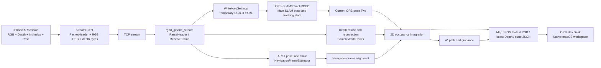

# iPhone RGB-D Navigation Architecture

This document describes the current end-to-end data flow implemented in this repository for the `iPhone RGB-D -> ORB-SLAM3 -> ORB Nav Desk` workflow.

It focuses on:

- what each stage consumes and produces
- which data participates in the main SLAM chain
- which data is only used for side-channel alignment or validation
- what user-visible effect each stage creates

## 1. Current Main Workflow

The default interactive workflow is:

1. The `LiDARMapPreview` iPhone app starts an `ARSession`.
2. The phone streams `RGB + Depth + Intrinsics + Pose` over TCP.
3. `rgbd_iphone_stream` receives the stream on macOS.
4. The backend writes a temporary RGB-D camera YAML and runs `ORB-SLAM3::TrackRGBD`.
5. The backend builds a 2D navigation grid from RGB-D observations and ORB pose.
6. The backend exports state, guidance, latest preview images, and structured map JSON.
7. `ORB Nav Desk` reads those files and renders a native macOS control surface.

Key entry points:

- iPhone app:
  - `iOS/LiDARMapPreview/Sources/SessionModel.swift`
  - `iOS/LiDARMapPreview/Sources/StreamClient.swift`
- RGB-D backend:
  - `Examples/RGB-D/rgbd_iphone_stream.cc`
- macOS app:
  - `macOS/ORBNavDesk/Sources/AppModel.swift`
  - `macOS/ORBNavDesk/Sources/LiveImageView.swift`

## 2. Main Chain vs Side Chain

### 2.1 Main chain

The main SLAM chain is:

`RGB + Depth + Intrinsics -> ORB-SLAM3 TrackRGBD -> ORB pose / tracking state`

This is the chain that performs the actual RGB-D SLAM.

### 2.2 Side chain

The side chain is:

`iPhone ARKit pose -> navigation-frame alignment + distance comparison`

The ARKit pose is currently used for:

- aligning the navigation display frame toward a gravity-consistent frame
- computing `phoneDistanceMeters`
- computing the displayed `scaleRatio = orbDistanceMeters / phoneDistanceMeters`

The ARKit pose is not used to replace the ORB-SLAM3 pose.

## 3. Architecture Diagram

## 4. Stage-by-Stage Data Flow

## 4.1 iPhone AR session stage

Source:

- `iOS/LiDARMapPreview/Sources/SessionModel.swift`

Core behavior:

- starts `ARWorldTrackingConfiguration`
- enables `smoothedSceneDepth` when available, otherwise `sceneDepth`
- enables `sceneReconstruction` when supported

Purpose:

- produce synchronized camera frames, depth, and device pose

Effect:

- each frame may carry:
  - RGB image
  - ARKit depth map
  - camera intrinsics
  - camera transform

Important note:

- the iPhone app is the sensor and transport layer
- it is not running ORB-SLAM3 locally

## 4.2 iPhone packetization stage

Source:

- `iOS/LiDARMapPreview/Sources/StreamClient.swift`

Core behavior:

- compresses RGB to JPEG
- converts ARKit depth to `UInt16` millimeters
- rescales `fx/fy/cx/cy` to match the transmitted image/depth dimensions
- serializes the current camera transform into a 4x4 row-major float array

Purpose:

- send the minimum data required for remote RGB-D SLAM and navigation display

Effect:

- one TCP payload contains:
  - packet header JSON
  - RGB bytes
  - depth bytes

## 4.3 Transport and receive stage

Source:

- `Examples/RGB-D/rgbd_iphone_stream.cc`

Core behavior:

- accepts a TCP client from the phone
- checks packet magic
- parses header JSON
- decodes JPEG into `cv::Mat`
- restores depth bytes into `CV_16UC1` millimeter depth

Purpose:

- reconstruct an RGB-D frame on macOS that ORB-SLAM3 can consume directly

Effect:

- backend obtains:
  - `rgb`
  - `depthMm`
  - intrinsics
  - display orientation
  - optional phone pose

## 4.4 Auto camera settings stage

Source:

- `Examples/RGB-D/rgbd_iphone_stream.cc`

Core behavior:

- writes a temporary YAML in `/tmp`
- populates pinhole camera parameters
- sets `RGBD.DepthMapFactor: 1000.0`

Purpose:

- adapt the current iPhone RGB-D stream into an ORB-SLAM3-compatible RGB-D camera configuration

Effect:

- ORB-SLAM3 can be started without manually calibrating and editing a fixed YAML for every run

## 4.5 Main SLAM stage

Source:

- `Examples/RGB-D/rgbd_iphone_stream.cc`
- ORB-SLAM3 core

Core behavior:

- resizes depth to RGB resolution when needed
- optionally rescales the frame for runtime processing
- calls `slam->TrackRGBD(slamRgb, slamDepth, timestamp)`

Purpose:

- produce the main RGB-D SLAM pose
- produce the main tracking state

Effect:

- current pose comes from ORB-SLAM3
- `trackingState` and `hasPose` are derived from ORB-SLAM3

Important note:

- this is the authoritative pose used for navigation map generation

## 4.6 Navigation-frame alignment stage

Source:

- `Examples/RGB-D/rgbd_iphone_stream.cc`

Core behavior:

- uses phone pose only if present
- estimates a quaternion that rotates ORB coordinates into a gravity-consistent navigation frame
- smooths that alignment over time

Purpose:

- keep the 2D navigation display from being arbitrarily tilted in ORB world coordinates

Effect:

- the displayed 2D map becomes easier to interpret
- ORB pose remains the main pose

Important note:

- this stage does not replace ORB pose
- it only rotates the display/navigation frame

## 4.7 Scale diagnostics stage

Source:

- `Examples/RGB-D/rgbd_iphone_stream.cc`

Core behavior:

- accumulates path length from ORB poses
- accumulates path length from phone poses
- computes `scaleRatio`

Purpose:

- provide a side-channel scale sanity check

Effect:

- the UI can display:
  - `ORB 里程`
  - `参考里程`
  - `尺度比`

Important note:

- `scaleRatio` is informational only
- it is not used to feed corrections back into the main SLAM chain

## 4.8 3D point sampling stage

Source:

- `Examples/RGB-D/rgbd_iphone_stream.cc`

Core behavior:

- samples depth pixels with stride
- converts millimeter depth to meters
- unprojects pixels into 3D camera points using `fx/fy/cx/cy`
- transforms them into world coordinates with ORB pose

Purpose:

- turn RGB-D observations into world-frame geometry usable for navigation mapping

Effect:

- generates a sparse but navigation-oriented world point set for each frame

## 4.9 Floor estimation stage

Source:

- `Examples/RGB-D/rgbd_iphone_stream.cc`

Core behavior:

- estimates `floorY` from observed points when in adaptive mode
- falls back to `cameraY + fixedCameraHeightMeters` when needed
- smooths the estimate over time

Purpose:

- separate near-floor free space from obstacles for 2D navigation projection

Effect:

- the 2D grid can classify regions as:
  - free
  - occupied
  - inflated obstacle buffer

Important note:

- this affects the navigation layer
- it does not change ORB-SLAM3 tracking itself

## 4.10 2D occupancy integration stage

Source:

- `Examples/RGB-D/rgbd_iphone_stream.cc`

Core behavior:

- projects sampled world points into a 2D occupancy grid
- raycasts free cells between robot position and observed endpoints
- marks endpoints near obstacle height as occupied
- inflates obstacles when enabled

Purpose:

- convert 3D RGB-D observations into a 2D map better suited for ground robot navigation

Effect:

- creates the 2D navigation map shown in the app:
  - free cells
  - occupied cells
  - inflated cells

Important note:

- this map is a navigation grid
- it is not ORB-SLAM3’s native sparse feature map

## 4.11 Trajectory, planning, and guidance stage

Source:

- `Examples/RGB-D/rgbd_iphone_stream.cc`

Core behavior:

- appends robot trajectory samples from the current ORB pose
- plans a grid path with A*
- computes a lookahead waypoint
- computes heading error between robot forward direction and target direction

Purpose:

- bridge the gap between “mapping and localization” and “navigation-ready outputs”

Effect:

- map shows:
  - robot trajectory
  - current goal
  - planned path
- guidance JSON exposes:
  - `waypoint_distance_m`
  - `heading_error_deg`

## 4.12 Artifact export stage

Source:

- `Examples/RGB-D/rgbd_iphone_stream.cc`

Core behavior:

- writes latest RGB image
- writes latest depth preview
- writes latest composite workspace image
- writes backend runtime state JSON
- writes structured map JSON
- writes guidance JSON

Purpose:

- decouple the backend processing loop from the macOS UI layer

Effect:

- the macOS app can render and control the system without directly embedding backend OpenCV drawing logic

## 4.13 Native macOS app stage

Source:

- `macOS/ORBNavDesk/Sources/AppModel.swift`
- `macOS/ORBNavDesk/Sources/LiveImageView.swift`
- `macOS/ORBNavDesk/Sources/InspectorView.swift`

Core behavior:

- starts the backend process
- polls runtime state and map JSON
- loads latest RGB and depth preview images
- renders the 2D map natively
- writes control JSON back to the backend

Purpose:

- provide a native control desk instead of a single OpenCV debug window

Effect:

- native map rendering
- native inspector and diagnostics
- goal setting from the map
- mode switching and parameter control from macOS UI

## 5. Key Data Structures

## 5.1 iPhone stream packet header

Defined in:

- `iOS/LiDARMapPreview/Sources/StreamClient.swift`

Fields:

| Field | Type | Meaning |
|---|---|---|
| `version` | `Int` | Packet format version |
| `frameIndex` | `UInt64` | Monotonic frame sequence |
| `timestamp` | `Double` | ARFrame timestamp |
| `displayOrientation` | `String` | Phone orientation code for preview rotation |
| `rgbWidth`, `rgbHeight` | `Int` | Encoded RGB frame size |
| `depthWidth`, `depthHeight` | `Int` | Depth map size |
| `fx`, `fy`, `cx`, `cy` | `Float` | Camera intrinsics rescaled to transmitted dimensions |
| `pose` | `[Float]` | 4x4 camera transform matrix |
| `rgbSize` | `Int` | JPEG payload length |
| `depthSize` | `Int` | Depth payload length |

Purpose:

- describe the RGB-D frame without ambiguity

## 5.2 Backend runtime state JSON

Defined in:

- `macOS/ORBNavDesk/Sources/NavigationState.swift`

Fields:

| Field | Meaning |
|---|---|
| `connected` | whether the iPhone stream is connected |
| `trackingState` | ORB-SLAM3 tracking state |
| `hasPose` | whether the backend currently trusts the pose |
| `floorY` | current estimated navigation floor height |
| `localizationOnly` | whether localization-only mode is active |
| `fixedHeightMode` | whether navigation uses fixed camera height |
| `fixedCameraHeightMeters` | current fixed camera height setting |
| `inflationRadiusCells` | obstacle inflation radius |
| `showInflation` | whether inflated buffer is enabled |
| `lookaheadMeters` | guidance lookahead distance |
| `orbDistanceMeters` | accumulated ORB path length |
| `phoneDistanceMeters` | accumulated phone reference path length |
| `scaleRatio` | ORB/reference ratio |
| `hasGoal`, `pathValid`, `hasWaypoint` | planning state |
| `waypointDistanceMeters` | next waypoint distance |
| `headingErrorDegrees` | steering error |
| `viewCenterX`, `viewCenterZ`, `metersPerPixel` | current map view state |
| `followRobot`, `autoFit` | current view behavior |
| `latestImagePath`, `latestRgbPath`, `latestDepthPath` | preview image files |
| `mapDataPath` | structured map JSON path |
| `guidancePath` | guidance JSON path |

Purpose:

- synchronize the backend and the macOS UI

## 5.3 Map render JSON

Defined in:

- `macOS/ORBNavDesk/Sources/NavigationMapData.swift`

Fields:

| Field | Meaning |
|---|---|
| `timestamp` | map export time |
| `resolution` | grid resolution in meters |
| `metersPerPixel` | current view scale |
| `viewCenterX`, `viewCenterZ` | current map center |
| `showInflation` | whether inflation is enabled |
| `inflationRadiusCells` | inflation radius in grid cells |
| `hasPose` | whether robot pose is valid |
| `robot` | robot position and forward vector |
| `goal` | goal point in world coordinates |
| `freeCells` | free-space cells |
| `occupiedCells` | occupied cells |
| `inflatedCells` | obstacle buffer cells |
| `trajectory` | robot trajectory points |
| `path` | planned path points |

Purpose:

- give the macOS app enough structured data to draw the navigation map natively

## 5.4 Guidance JSON

Written by:

- `Examples/RGB-D/rgbd_iphone_stream.cc`

Fields:

| Field | Meaning |
|---|---|
| `has_pose` | whether current robot pose is valid |
| `tracking_state` | current tracking state |
| `fixed_height_mode` | current navigation mode |
| `fixed_camera_height_m` | current fixed camera height |
| `has_waypoint` | whether a next waypoint exists |
| `waypoint_distance_m` | distance to the next waypoint |
| `heading_error_deg` | signed angular error to the waypoint |

Purpose:

- provide a compact interface for a future robot controller or external consumer

## 5.5 Control JSON

Defined in:

- `macOS/ORBNavDesk/Sources/NavigationState.swift`

Fields:

| Field | Meaning |
|---|---|
| `revision` | monotonic control version |
| `viewMode` | follow / overview / manual |
| `clearGoal` | clear current goal |
| `saveSnapshot` | request a snapshot |
| `quit` | stop backend |
| `fixedHeightMode` | switch adaptive/fixed-height mode |
| `fixedCameraHeightMeters` | update fixed camera height |
| `inflationRadiusCells` | update inflation radius |
| `showInflation` | toggle inflation |
| `lookaheadMeters` | update lookahead distance |
| `localizationOnly` | toggle localization-only mode |
| `setGoal`, `goalWorldX`, `goalWorldZ` | set a goal point from the map |

Purpose:

- let the native app steer backend behavior without linking directly against backend code

## 6. Current User-Visible Results

Today, this codebase achieves:

- iPhone RGB-D streaming over TCP
- ORB-SLAM3 RGB-D pose tracking on macOS
- 2D occupancy-grid navigation map generation
- trajectory display
- grid path planning
- next-waypoint and heading guidance output
- a native macOS control desk with map rendering and diagnostics

## 7. Current Boundaries

The current implementation still has clear limits:

- the 2D navigation map is derived from RGB-D reprojection and floor heuristics
- ARKit pose is still present as a side-channel alignment and scale reference
- the system does not yet send direct velocity commands to a robot base
- long-term persistent relocalization and production-grade costmap layering are not finished

So the current system is best described as:

`RGB-D ORB-SLAM3 navigation prototype with native desktop operations`

rather than:

`finished indoor robot navigation stack`

## 8. Practical Summary

If you want one sentence that captures the current architecture, it is:

`The iPhone acts as an RGB-D sensor head, ORB-SLAM3 performs the main RGB-D SLAM on macOS, the backend converts RGB-D observations into a 2D navigation grid plus guidance outputs, and ORB Nav Desk provides a native macOS operator UI on top of that pipeline.`
